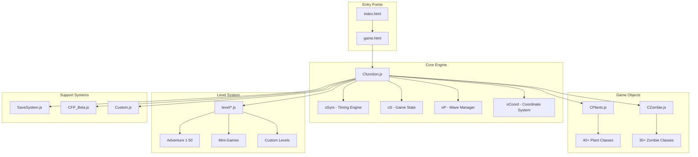

# 🌻 Plants vs. Zombies Web Game - Complete Analysis 🧟

## Overview

This is a **web-based recreation of Plants vs. Zombies** built using vanilla HTML, CSS, and JavaScript. The game runs entirely in the browser and includes:

- **50+ Adventure Mode levels** (5 worlds × 10 levels each)
- **16+ Mini-Games** (Wall-nut Bowling, I,Zombie, Vasebreaker, etc.)
- **Custom Level Editor** (for I,Zombie mode)
- **Professional Save System** with multi-user support

---

## 🏗️ Architecture Overview



---

## 📁 Key Files and Their Roles

### Entry Points

| File | Purpose |
|------|---------|
| [index.html](file:///c:/Users/Idriss%20Boukmouche/Downloads/pvz-main/index.html) | Wrapper with sidebar panel (profile, stats, controls) |
| [game.html](file:///c:/Users/Idriss%20Boukmouche/Downloads/pvz-main/game.html) | Main game interface, loaded in iframe |

### Core JavaScript

| File | Lines | Purpose |
|------|-------|---------|
| [Cfunction.js](file:///c:/Users/Idriss%20Boukmouche/Downloads/pvz-main/js/Cfunction.js) | ~3500 | Core game engine, timing, coordinates, UI, wave system |
| [CPlants.js](file:///c:/Users/Idriss%20Boukmouche/Downloads/pvz-main/js/CPlants.js) | ~8500 | All plant class definitions (40+ types) |
| [CZombie.js](file:///c:/Users/Idriss%20Boukmouche/Downloads/pvz-main/js/CZombie.js) | ~12000 | All zombie class definitions (30+ types) |
| [SaveSystem.js](file:///c:/Users/Idriss%20Boukmouche/Downloads/pvz-main/js/SaveSystem.js) | ~1078 | Multi-user save system with localStorage |
| [CFP_Beta.js](file:///c:/Users/Idriss%20Boukmouche/Downloads/pvz-main/js/CFP_Beta.js) | ~338 | Level save/load with compression (pako) |
| [Custom.js](file:///c:/Users/Idriss%20Boukmouche/Downloads/pvz-main/js/Custom.js) | ~287 | Adventure progress tracking, audio helpers |

---

## 🎮 Core Game Objects

### 1. **`oSym` - Timing Engine**
The heart of the game's animation and scheduling system:

```javascript
var oSym = {
    Now: 0,              // Current game time
    Timer: null,         // Main animation timer
    TQ: [],              // Task Queue
    NowStep: 1,          // Time increment per tick
    TimeStep: 10,        // Milliseconds between ticks
    
    addTask(delay, func, args)  // Schedule a function
    removeTask(index)           // Cancel a task
    Start() / Stop()            // Control game loop
};
```

### 2. **[oS](file:///c:/Users/Idriss%20Boukmouche/Downloads/pvz-main/js/SaveSystem.js#320-338) - Game State**
Central configuration and state object:

```javascript
var oS = {
    Version: 5,
    W: 1080, H: 720,     // Game dimensions
    C: 9,                // Columns
    R: 5,                // Rows (set by oCoord)
    Lvl: 0,              // Current level ID
    SunNum: 50,          // Current sun count
    
    // Level configuration (set by level files)
    PName: [],           // Available plants
    ZName: [],           // Zombies in this level
    LF: [],              // Lane flags (0=none, 1=grass, 2=water)
    backgroundImage: "", // Background path
    LevelName: "",       // Display name
    
    Init(levelConfig, waveConfig, customFunctions)
};
```

### 3. **[oP](file:///c:/Users/Idriss%20Boukmouche/Downloads/pvz-main/js/CFP_Beta.js#278-291) - Wave/Progress Manager**
Controls zombie waves and level progression:

```javascript
var oP = {
    FlagNum: 5,          // Total waves
    FlagZombies: 0,      // Current wave
    NumZombies: 0,       // Zombies remaining in wave
    
    MonPrgs()            // Monitor progress, trigger next wave
    AddZombiesFlag()     // Spawn zombies for current wave
    FlagToEnd()          // Level completion handler
};
```

### 4. **`oCoord` - Coordinate System**
Handles different board layouts:

```javascript
oCoord = {
    1: function() { /* 5-row lawn */ },
    2: function() { /* 6-row pool */ }
};

// Key functions created:
GetX(col)      // Column → X pixels
GetY(row)      // Row → Y pixels
GetC(x)        // X pixels → Column
GetR(y)        // Y pixels → Row
GetX1X2(col)   // Column → [minX, maxX] bounds
GetY1Y2(row)   // Row → [minY, maxY] bounds
```

---

## 🌱 Plant System

### Base Class: `CPlants`

```javascript
var CPlants = NewO({
    name: "Plants",
    HP: 300,
    PKind: 1,              // Plant kind (for grid stacking)
    SunNum: 100,           // Cost in sun
    coolTime: 7.5,         // Seconds to recharge
    width: 70,
    height: 80,
    beAttackedPointL: 20,  // Hitbox left edge
    beAttackedPointR: 50,  // Hitbox right edge
    
    // Key methods
    Birth(x, y, row, col, gridInfo)
    Die() / BoomDie()
    getHurt(attacker, type, damage)
    NormalAttack(targetId)
    CanGrow(gridInfo, row, col)  // Placement validation
});
```

### Plant Inheritance Chain

```
CPlants (base)
├── oSunFlower      → produces sun
├── oPeashooter     → shoots peas
│   └── oSnowPea    → shoots ice peas
│   └── oRepeater   → shoots double peas
├── oWallNut        → high HP wall
├── oCherryBomb     → area explosion
├── oSquash         → jumps on zombies
├── oGraveBuster    → removes graves
├── oLawnCleaner    → lane cleaner (special)
└── ... 40+ more plants
```

### Plant Trigger System

Plants use a **trigger range system** for attacks:

```javascript
// Each plant defines trigger ranges per row
getTriggerRange(row, attackedLX, attackedRX) {
    return [[minX, maxX, type]];  // Array of ranges
}

// Zombies check if they're in trigger range
TriggerCheck(zombie, rangeData) {
    if (this.AttackCheck2(zombie)) {
        this.NormalAttack(zombie.id);
    }
}
```

---

## 🧟 Zombie System

### Base Class: `CZombies`

```javascript
var CZombies = function() {
    // Instance properties
    this.HP = 270;
    this.Speed = 1.6;
    this.OSpeed = 1.6;         // Original speed
    this.Altitude = 1;          // 0=underground, 1=ground, 2=flying
    this.isAttacking = 0;
    this.FreeFreezeTime = 0;    // Frozen until this time
    this.FreeSlowTime = 0;      // Slowed until this time
    
    // Layout
    this.width = 166;
    this.height = 144;
    this.beAttackedPointL = 82;
    this.beAttackedPointR: 156;
    
    // Animation GIF indices
    this.NormalGif = 2;
    this.AttackGif = 3;
    this.LostHeadGif = 4;
    this.DieGif = 7;
    this.BoomDieGif = 8;
};
```

### Zombie Action Loop

```javascript
// Called every game tick for each zombie
ChkActs(self, row, zombieArray, index) {
    if (frozen || stunned) return;
    
    if (!self.isAttacking) {
        // Move left
        self.AttackedRX -= self.Speed;
        self.Ele.style.left = self.X + "px";
        
        // Check if reached end
        if (self.AttackedRX < -50) {
            self.DisappearDie();
        }
    }
    
    // Check for plants to attack
    self.JudgeAttack();
}
```

### Zombie Types

```
CZombies (base)
├── oZombie (normal)
│   └── oZombie2. oZombie3 (variants)
├── oConeheadZombie (HP: 370)
├── oBucketheadZombie (HP: 1100)
├── oFootballZombie (fast, high HP)
├── oPoleVaultingZombie (jumps plants)
├── oDancingZombie (summons dancers)
├── oGargantuarZombie (throws imp)
└── ... 30+ more zombies
```

---

## 📊 Level Configuration System

Levels are defined by calling `oS.Init()` with 3 parameters:

### Parameter 1: Level Settings

```javascript
{
    PName: [oPeashooter, oSunFlower],  // Available plants
    ZName: [oZombie, oConeheadZombie], // Zombies in level
    SunNum: 50,                        // Starting sun
    backgroundImage: "images/interface/background1.jpg",
    LF: [0, 1, 1, 1, 1, 1],           // Lane flags
    LevelName: "Level 1-1",
    CanSelectCard: 1,                  // Allow card selection
    ProduceSun: true,                  // Sun falls from sky
    
    StartGame() { ... },               // Called when level starts
    InitLawnMower() { ... }            // Setup lawn mowers
}
```

### Parameter 2: Wave Configuration

```javascript
{
    AZ: [                              // Zombie pool
        [oZombie, 5, 1],               // [type, count, min_wave]
        [oConeheadZombie, 3, 3]
    ],
    FlagNum: 10,                       // Total waves
    FlagToSumNum: {                    // Zombies per wave
        a1: [3, 4, 5, 6],              // Normal waves
        a2: [5, 8, 10]                 // Large waves
    },
    FlagToMonitor: {                   // Special events
        9: [ShowLargeWave, 0],
        10: [ShowFinalWave, 0]
    },
    FlagToEnd() { ... }                // Victory handler
}
```

### Parameter 3: Custom Functions (optional)

```javascript
{
    AutoSelectCard() { ... },          // Auto-select cards
    GetChoseCard(id) { ... },          // Card selection logic
    GrowPlant(gridInfo, ...) { ... }   // Custom plant placement
}
```

---

## 🎯 Game Modes

### 1. Adventure Mode ([level/1.js](file:///c:/Users/Idriss%20Boukmouche/Downloads/pvz-main/level/1.js) - [level/50.js](file:///c:/Users/Idriss%20Boukmouche/Downloads/pvz-main/level/50.js))
Standard tower defense with progressive unlocks.

### 2. I, Zombie Mode (`level/izombie*.js`)
Reversed roles - player controls zombies to eat brains:

```javascript
{
    CardKind: 1,         // 1 = zombie cards
    BrainsNum: 5,        // Brains to collect
    ProduceSun: false,   // No sun production
    ArP: {               // Pre-placed plants
        ArC: [1, 4],     // Column range
        ArR: [1, 5],     // Row range
        P: [0,0,1,1,2]   // Plant indices (random)
    }
}
```

### 3. Vasebreaker (`level/vasebreaker*.js`)
Break vases to reveal plants/zombies:

```javascript
{
    VaseArP: {
        GreenNum: 2,           // Green vases (reveal plant)
        Left: 5, Right: 9,     // Column range
        ZombieP: [0,0,1,1],    // Zombie indices
        PlantP: [1,1,2,2]      // Plant indices
    }
}
```

### 4. Wall-nut Bowling ([level/WallNutBowling.js](file:///c:/Users/Idriss%20Boukmouche/Downloads/pvz-main/level/WallNutBowling.js))
Roll wall-nuts to crush zombies:

```javascript
{
    PName: [oNutBowling, oHugeNutBowling, oBoomNutBowling],
    StaticCard: 0,       // Cards spawn dynamically
    // Cards drop from above and queue up
}
```

---

## 💾 Save System

### `PVZSaveSystem` (Modern)

```javascript
PVZSaveSystem = {
    // User management
    createUser(username)
    switchUser(username)
    deleteUser(username)
    getCurrentUser()
    getAllUsers()
    
    // Progress
    saveProgress()
    autoSave()
    onLevelComplete(levelId, stats)
    
    // Plants
    unlockPlant(plantName)
    isPlantUnlocked(plantName)
    
    // Currency
    addCurrency(type, amount)
    spendCurrency(type, amount)
    
    // Import/Export
    exportSave()
    importSave()
}
```

### Save Data Structure

```javascript
{
    version: "2.0.0",
    profile: { username, avatar, playTime },
    progress: {
        currentLevel: 1,
        highestLevel: 1,
        completedLevels: [],
        achievements: []
    },
    plants: { unlocked: ["oPeashooter", "oSunFlower"] },
    currency: { sun: 0, coins: 0 },
    statistics: { zombiesKilled: 0, gamesWon: 0 }
}
```

---

## 🔧 Key Helper Functions

| Function | Purpose |
|----------|---------|
| `NewO(obj)` | Create new class prototype |
| `InheritO(parent, child)` | Inheritance helper |
| `NewEle(id, tag, style, attrs, parent)` | Create DOM element |
| `NewImg(id, src, style, parent, events)` | Create image element |
| `$(id)` | Get element by ID |
| `SetBlock/SetHidden/SetVisible(el)` | Toggle visibility |
| `PlayAudio(name)` / `PlayMusic(name)` | Audio playback |
| `CustomSpecial(PlantClass, row, col)` | Spawn plant |

---

## 📝 How to Modify the Game

### Adding a New Plant

1. Define in [CPlants.js](file:///c:/Users/Idriss%20Boukmouche/Downloads/pvz-main/js/CPlants.js):
```javascript
var oMyPlant = InheritO(CPlants, {
    EName: "oMyPlant",
    CName: "My Plant",
    SunNum: 100,
    HP: 300,
    width: 70, height: 80,
    PicArr: ["images/Card/Plants/MyPlant.png", ...],
    NormalAttack() { ... }
});
```

2. Add to level's `PName` array

### Adding a New Zombie

1. Define in [CZombie.js](file:///c:/Users/Idriss%20Boukmouche/Downloads/pvz-main/js/CZombie.js):
```javascript
var oMyZombie = InheritO(CZombies, {
    EName: "oMyZombie",
    CName: "My Zombie",
    HP: 500,
    Speed: 2.0,
    PicArr: [...],
    JudgeAttack() { ... }
});
```

2. Add to level's `ZName` and `AZ` arrays

### Creating a New Level

1. Create `level/myLevel.js`:
```javascript
oS.Init(
    { PName: [...], ZName: [...], SunNum: 50, ... },
    { AZ: [...], FlagNum: 10, ... }
);
```

2. Add to mini-game menu in [game.html](file:///c:/Users/Idriss%20Boukmouche/Downloads/pvz-main/game.html)

---

## 🎨 Assets Structure

```
images/
├── Card/
│   ├── Plants/     # Plant card images (selection UI)
│   └── Zombies/    # Zombie card images
├── Plants/
│   └── [PlantName]/
│       ├── 0.gif        # Static
│       ├── [Name].gif   # Normal animation
│       └── ...          # Other states
├── Zombies/
│   └── [ZombieName]/
│       ├── 0.gif        # Static
│       ├── [Name].gif   # Walking
│       ├── Attack.gif
│       ├── Die.gif
│       └── ...
└── interface/      # UI elements
```

---

## ⚠️ Important Notes

1. **Timing**: All game timing uses `oSym.addTask(delay, func, args)` - delays are in game ticks (~10ms each)

2. **Coordinates**: Use [GetX()](file:///c:/Users/Idriss%20Boukmouche/Downloads/pvz-main/js/Cfunction.js#623-641), [GetY()](file:///c:/Users/Idriss%20Boukmouche/Downloads/pvz-main/js/Cfunction.js#545-555) for placement, [GetC()](file:///c:/Users/Idriss%20Boukmouche/Downloads/pvz-main/js/Cfunction.js#617-620), [GetR()](file:///c:/Users/Idriss%20Boukmouche/Downloads/pvz-main/js/Cfunction.js#620-623) for collision detection

3. **Grid System**: `oGd.$` stores all placed plants as `{row}_{col}_{pkind}`

4. **Zombie Arrays**: `$Z[]` holds all active zombies, `oZ.getArZ(x1, x2, row)` finds zombies in range

5. **Plant Arrays**: `$P[]` holds all active plants

---

This analysis provides the foundation for making modifications to the game. The modular architecture allows easy addition of new plants, zombies, and game modes.
